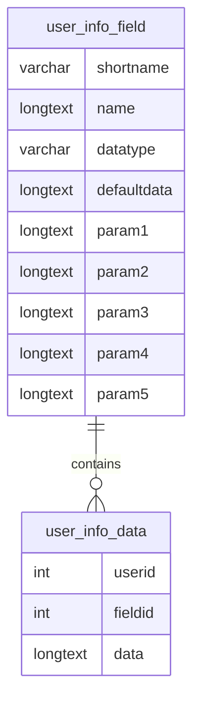

# Call summons #

This plugin allows to add a user profile field in order to show notifications to users who belong to a specific group.

In the user profile field you only have to specify the short name, the name of the user and the names of the groups whose members will see the notifications. The user profile field cannot be edited or viewed on the user profile page. Multiple groups can be added simultaneously.

Three type of notifications will be displayed:
- a block in the Dashboard will list the courses that have a group named after the groups defined in the profile field settings.
- a course warning in the course page, that can be dismissed and won't be displayed again unless an administrator reset the warnings display.
- if the block block_course_termlist is installed, a icon will be displayed along the courses that have a group named after the groups defined in the profile field settings. This icon has the class **callsummons-_shortname_-icon**.

## Installing via uploaded ZIP file ##

1. Log in to your Moodle site as an admin and go to _Site administration >
   Plugins > Install plugins_.
2. Upload the ZIP file with the plugin code. You should only be prompted to add
   extra details if your plugin type is not automatically detected.
3. Check the plugin validation report and finish the installation.

## Installing manually ##

The plugin can be also installed by putting the contents of this directory to

    {your/moodle/dirroot}/user/profile/field/callsummons

Afterwards, log in to your Moodle site as an admin and go to _Site administration >
Notifications_ to complete the installation.

Alternatively, you can run

    $ php admin/cli/upgrade.php

to complete the installation from the command line.

## Adding a new field ##
As an admin and go to _Site administration > Users > User profile fields_.
In the _Create a new field_ selector, choose *Call summons*.
Settings:

**Common**
- Short name: unique identifier of the profile field.
- Name: descriptive name of the profile field. Currently is the text displayed in the notifications.
- Other common settings can't be modified.

**Specific**
- Enabled: allows to deactivate the profile field temporarily.
- Groups to check: group names that trigger the notifications.
- Cancel notifications (work in progress): allows users to dismiss the notifications in the course page.
- Notifications icon: icon to display in the course_termlist block. Use the syntax _fa-*_, where * is the name of the icon to display.
- Always display the icon: by default the icon in the block course_termlist is hidden if a notification has been dismissed. Enabling this setting will always display the icon.

When editing an existing profile field, an additional **Reset** button is available to display again the notifications discarded by users.

## Technical details ##
### Database ###
This plugin is enterily implemented as a user profield field; the main tables and columns involved are:

The profile field settings are stored in the defaultdata and param columns of the user_info_field:
- **defaultdata**: value by default for a user profile field. It cannot be defined. It's an empty string by default.
- **param1**: enable(1)/disable(0) the profile field, disabled by default.
- **param2**: name of the group that triggers the notifications. Each member of a group with this name in any course will see the notifications.
- **param3**: allow users to dimiss the notifications in the course page(1) or not(0). Not allowed by default.
- **param4**: icon to display in the course_termlist block.
- **param5**: display the icon in the course_termlist even if the user has dismissed it in the course(1) or not(0). Display always by default.

The user data is store in the _data_ column of the user_info_data table:
- **fieldid**: id of an existing call summons profile field.
- **userid**: id of a user that belongs to a group of the profile field.
- **data**: serialized array in the form _courseid_ => timestamp, where the timestamp is the time a user dismissed the notification in the course page.

### Data update ###
The information about profile fields is stored in the $USER global variable. It is populated using a task, _user/profile/field/callsummons/classes/task/update_user_profile_values.php_, that checks the changes in the groups memberships to update the _user_info_data_ table and load the right data in $USER when a user logins.

As a caveat, changes to group membership, notifications dismissed or mofications to the profile field settings are only effective after the user logs in.

## License ##

This program is free software: you can redistribute it and/or modify it under
the terms of the GNU General Public License as published by the Free Software
Foundation, either version 3 of the License, or (at your option) any later
version.

This program is distributed in the hope that it will be useful, but WITHOUT ANY
WARRANTY; without even the implied warranty of MERCHANTABILITY or FITNESS FOR A
PARTICULAR PURPOSE.  See the GNU General Public License for more details.

You should have received a copy of the GNU General Public License along with
this program.  If not, see <https://www.gnu.org/licenses/>.
